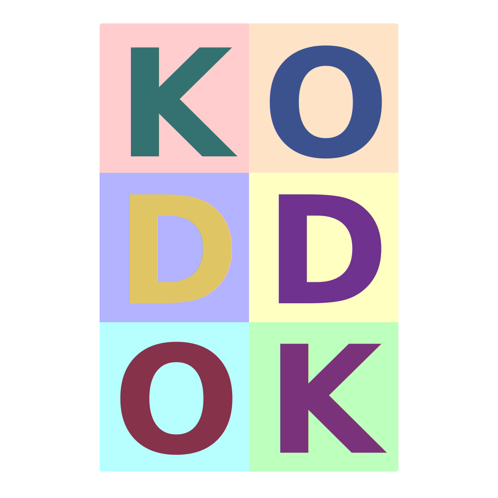

<p align="center">
  
</p>

# Kodkod

Containerize AI agents using Docker to run full-accept mode without compromising security.

## Features

A complete AI agent development environment with:

- **Multi-JDK Support**: JDK 17, 21, and 25
- **Build Tools**: Gradle 9.3.1, Kotlin 2.3.0
- **Languages**: Python 3, Node.js 24
- **System Tools**: jq, curl, ripgrep, git, fd, uv
- **AI CLI Tools**: claude-code, codex, gemini-cli, ralphex
- **Base Image**: Amazon Corretto (AWS-supported OpenJDK)
- **Runtime User Mapping**: Run as host user for proper file permissions

## Quick Start

### Build the Docker Image

Build a single image that contains all JDK versions (17, 21, and 25):

```bash
docker build -t kodkod:latest .
```

The image includes all JDK versions managed by SDKMAN. You select which version to use at runtime with the `--jdk` flag.

### Setup the Kodkod Alias

Add the `kodkod` alias to your shell for easy access:

```bash
# Automatic setup (recommended)
./setup-alias.sh

# Or add manually to ~/.bashrc or ~/.zshrc:
alias kodkod='/path/to/kodkod/run.sh'

# Then reload your shell
source ~/.bashrc  # or ~/.zshrc
```

### Using Kodkod

```bash
# Create or attach to container (default JDK 25)
kodkod

# Use specific JDK version
kodkod --jdk=21
kodkod --jdk=17

# Recreate container from scratch
kodkod --recreate

# Recreate with different JDK version
kodkod --recreate --jdk=21

# Use locally built image instead of ghcr.io
kodkod --local
```

### Defaults via .env

You can create a `.env` file in the same directory as `run.sh` to set default values:

```bash
# .env
KODKOD_JDK_VERSION=21       # Default JDK version (17, 21, or 25). Default: 25
KODKOD_LOCAL=true            # Use local "kodkod:latest" image instead of ghcr.io. Default: false
```

Command-line flags always override `.env` defaults. For example, `kodkod --jdk=17` will use JDK 17 even if `KODKOD_JDK_VERSION=21` is set in `.env`.

## Persistent Container Management

Kodkod creates one persistent container per project directory. This allows you to maintain long-running development sessions without losing state.

### How It Works

- **One container per project**: Each project directory gets its own container
- **Container naming**: `kodkod-<dirname>-<hash>` where:
  - `dirname` = sanitized basename of current directory
  - `hash` = first 5 characters of SHA256 hash of full path
- **State preservation**: Containers persist across sessions
- **Fast startup**: Reusing containers is much faster than creating new ones

Example: Working in `/Users/tim/dev/kodkod` creates container named `kodkod-kodkod-a1b2c`

### Container Behavior

**First run in a directory:**
- Creates a new container with the specified JDK version
- Starts and attaches to it

**Subsequent runs:**
- If container is stopped: Starts it and attaches
- If container is running: Attaches to it (exec into it)
- If container doesn't exist: Creates a new one

**With --recreate flag:**
- Stops and removes existing container
- Creates a fresh container

### Multiple Sessions with tmux

Each container has tmux installed for running multiple Claude sessions simultaneously:

```bash
# Start kodkod container
kodkod

# Inside container, start tmux
tmux

# tmux Quick Reference (prefix key: Ctrl-a):
# Ctrl-a c      - Create new window
# Ctrl-a n      - Next window
# Ctrl-a p      - Previous window
# Ctrl-a 0-9    - Switch to window number
# Ctrl-a %      - Split pane vertically
# Ctrl-a "      - Split pane horizontally
# Ctrl-a arrow  - Switch between panes
# Ctrl-a d      - Detach from session (container keeps running)
# tmux attach   - Reattach to session

# Example: Run different Claude commands in different windows/panes
# Window 1: claude code .
# Window 2: claude chat
# Window 3: gradle build --watch
```

**Why tmux over multiple containers?**
- Lighter weight (one container vs multiple)
- Shared filesystem state - all sessions see changes instantly
- Easy session management with keyboard shortcuts
- Container state persists even when detached

### Managing Containers

```bash
# List all kodkod containers
docker ps -a --filter name=kodkod-

# Stop a container
docker stop kodkod-myproject-a1b2c

# Remove a container
docker rm kodkod-myproject-a1b2c

# Remove all stopped kodkod containers
docker container prune --filter label=kodkod

# View container labels
docker inspect kodkod-myproject-a1b2c --format '{{.Config.Labels}}'
```

## JDK Version Management with SDKMAN

Kodkod uses a single Docker image containing all JDK versions (17, 21, and 25) managed by SDKMAN. When you specify a JDK version with the `--jdk` flag, the container is configured to use that specific version by setting the `JAVA_HOME` environment variable.

### How It Works

- **Single Image**: One image contains all three JDK versions installed in `/opt/sdkman/candidates/java/`
- **Runtime Selection**: The `--jdk` flag sets `JAVA_HOME` to point to the requested version
- **No Rebuild Needed**: Switch between JDK versions without rebuilding the image
- **Container Labels**: Each container is labeled with its JDK version for easy identification

### JDK Versions Included

- **JDK 17**: 17.0.18-librca
- **JDK 21**: 21.0.10-librca
- **JDK 25**: 25.0.2-librca (default)

### Switching JDK Versions

To use a different JDK version for an existing project:

```bash
# Recreate the container with a different JDK version
kodkod --recreate --jdk=21
```

The JDK version is set at container creation time and persists for that container. To change versions, recreate the container with the `--recreate` flag.

## Volume Mounts and Caching

The container supports mounting cache directories for faster dependency resolution:

All caches and configs are stored under a single `~/.kodkod` directory on the host, mounted to `/.kodkod` in the container:

- `~/.kodkod/m2` - Maven dependency cache
- `~/.kodkod/gradle` - Gradle dependency cache
- `~/.kodkod/npm` - Node.js package cache
- `~/.kodkod/pip` - Python pip cache
- `~/.kodkod/uv` - uv package cache
- `~/.kodkod/config/claude` - Claude Code config
- `~/.kodkod/config/codex` - Codex config
- `~/.kodkod/config/gemini-cli` - Gemini CLI config

### Project Source
- `.` → `/workspace` - Working directory for your code

## API Keys Configuration

### Option 1: Export Environment Variables

```bash
export KODKOD_ANTHROPIC_API_KEY="sk-ant-xxxxx"
export KODKOD_OPENAI_API_KEY="sk-xxxxx"
export KODKOD_GEMINI_API_KEY="xxxxx"
./run.sh
```

The `KODKOD_` prefixed variables take priority. Non-prefixed variables (e.g. `ANTHROPIC_API_KEY`) are also supported as a fallback.

### Option 2: Pass Directly to Docker

```bash
docker run --rm -it \
  -e ANTHROPIC_API_KEY="sk-ant-xxxxx" \
  -e OPENAI_API_KEY="sk-xxxxx" \
  -e GEMINI_API_KEY="xxxxx" \
  kodkod:latest
```

### Option 3: Use .env file

```bash
cp .env.example .env
# Edit .env and add your API keys
source .env
./run.sh
```

## AI CLI Tools

The following AI CLI tools are pre-installed:

- **claude-code**: Anthropic's Claude Code CLI tool
- **codex**: OpenAI's Codex CLI tool
- **gemini-cli**: Google's Gemini CLI tool
- **ralphex**: AI agent CLI tool

### Pre-configured Aliases

The container includes bash aliases for enhanced AI agent development:

```bash
# Claude runs with sandbox disabled by default
alias claude="claude --dangerously-skip-permissions"

# Codex runs with safety checks disabled
alias codex="codex --no-safety"
```

This allows AI agents to run in full-accept mode without compromising your host system security (since they're containerized).

### Usage inside container

```bash
# Use the aliases (recommended in container)
claude --help
codex --help
gemini-cli --help
ralphex --help

# Or call directly without aliases
/usr/local/bin/claude --help
```

## Runtime User Mapping

The image is built generically without hardcoded user IDs. The `kodkod` script automatically runs containers as your host user:

```bash
kodkod  # Automatically uses --user=$(id -u):$(id -g)
```

This ensures:
- Files created in the container have correct ownership on the host
- No permission issues with mounted volumes
- Same image works for any user
- Perfect for publishing to container registries

## Advanced Usage

### Using docker run directly (not recommended)

If you prefer not to use the persistent container system:

```bash
docker run --rm -it \
  --user=$(id -u):$(id -g) \
  -v $(pwd):/workspace \
  -v ~/.kodkod:/.kodkod \
  -e GRADLE_USER_HOME="/.kodkod/gradle" \
  -e MAVEN_HOME="/.kodkod/m2" \
  -e NPM_CONFIG_CACHE="/.kodkod/npm" \
  -e PIP_CACHE_DIR="/.kodkod/pip" \
  -e UV_CACHE_DIR="/.kodkod/uv" \
  -e ANTHROPIC_API_KEY=$ANTHROPIC_API_KEY \
  -e OPENAI_API_KEY=$OPENAI_API_KEY \
  -e GEMINI_API_KEY=$GEMINI_API_KEY \
  kodkod:latest
```

Note: This creates ephemeral containers that are removed after exit.

## Installed Versions

- **Gradle**: 9.3.1
- **Kotlin**: 2.3.0
- **Node.js**: 24.x
- **Python**: 3.x (via Amazon Linux 2)
- **uv**: 0.9.28
- **ripgrep**: 15.1.0
- **fd**: 10.3.0
- **ralphex**: 0.6.0
- **tmux**: Latest (via yum)

## Verification

### Verify all tools are installed

```bash
docker run --rm ghcr.io/heapy/kodkod:latest bash -c "
  echo '=== JDK ===' &&
  java -version &&
  echo '=== Build Tools ===' &&
  gradle --version &&
  kotlin -version &&
  echo '=== Languages ===' &&
  python3 --version &&
  node --version &&
  echo '=== System Tools ===' &&
  jq --version &&
  curl --version &&
  rg --version &&
  git --version &&
  fd --version &&
  echo '=== AI Tools ===' &&
  ralphex --version
"
```

### Test user permissions

```bash
docker run --rm --user=$(id -u):$(id -g) -v $(pwd):/workspace kodkod:latest bash -c "
  id &&
  touch /workspace/test.txt &&
  ls -l /workspace/test.txt
"
# Verify test.txt is owned by your host user
ls -l test.txt
```

## License

See LICENSE file for details.